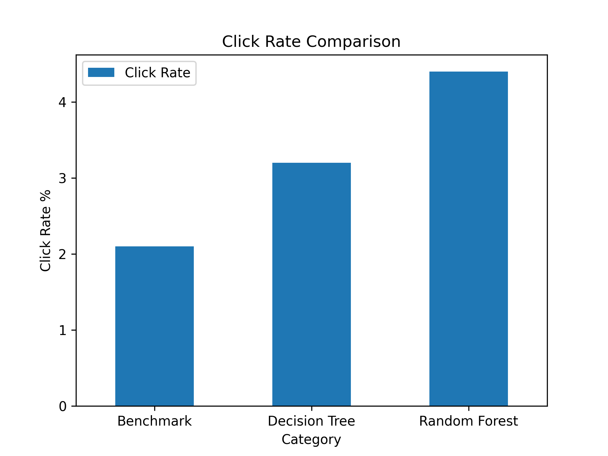
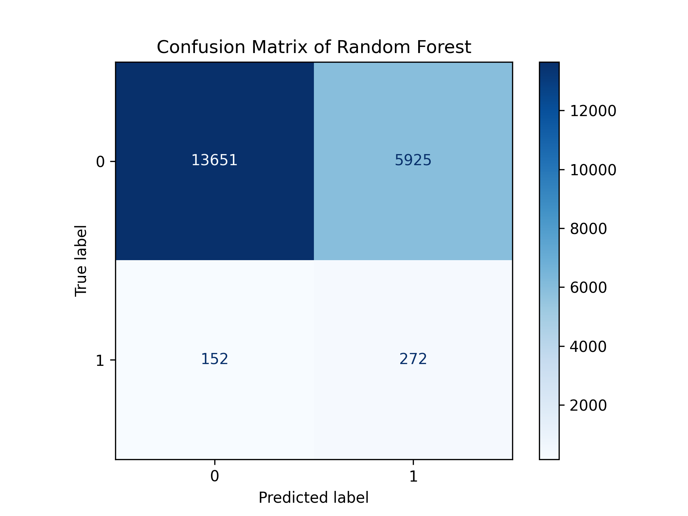
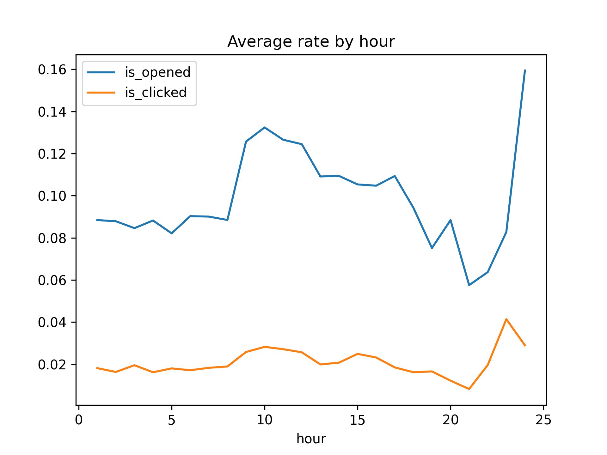
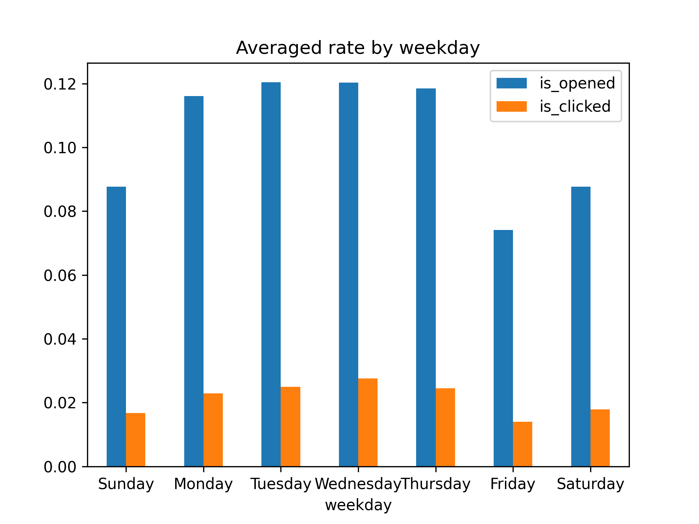
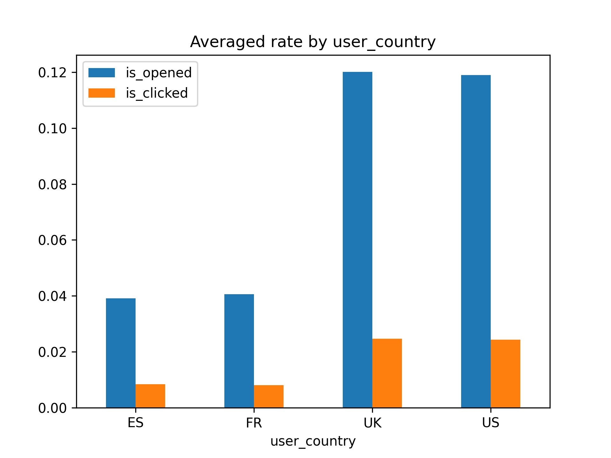
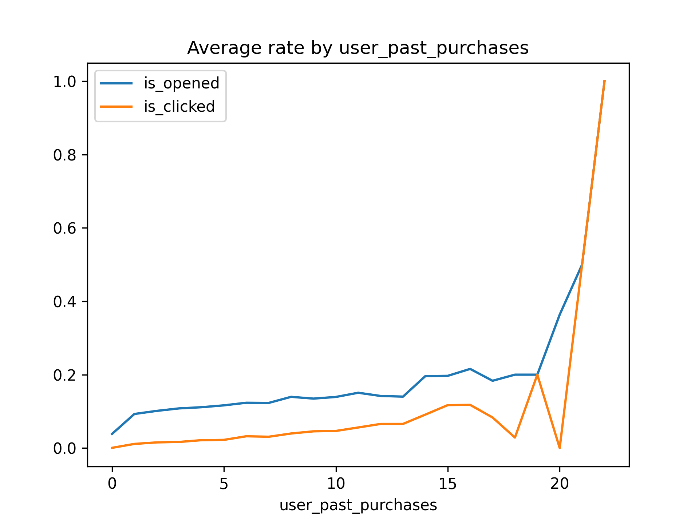
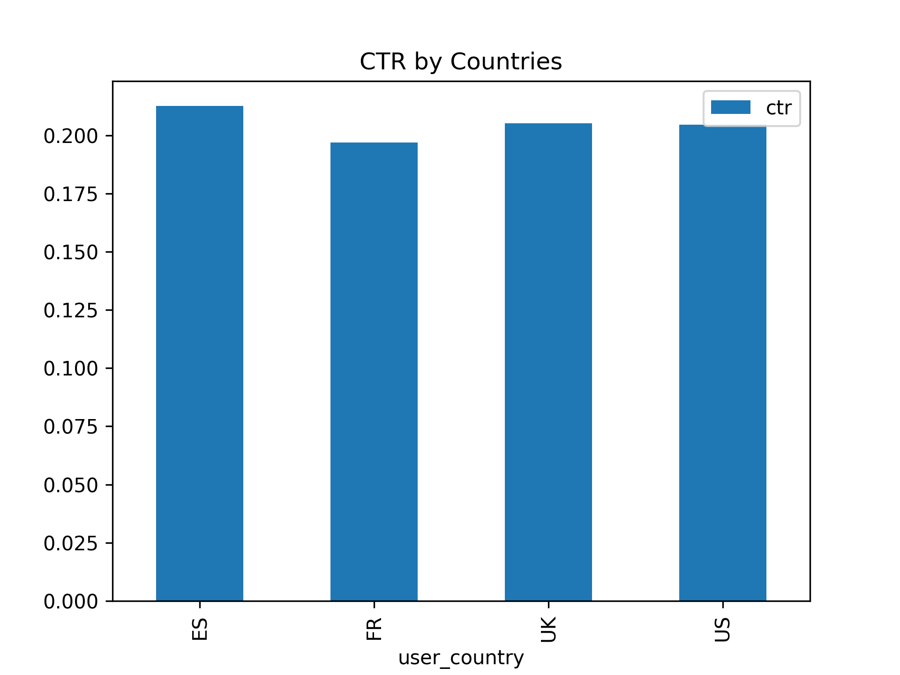

# Email Campaign Analysis

## Introduction

An email campaign is a strategic marketing effort that involves sending emails to a targeted audience with the aim of achieving specific business objectives. Email campaigns are meticulously crafted, often with personalized content and tailored messaging designed to resonate with recipients.

In the e-commerce industry, email campaigns play a pivotal role in engaging customers and driving sales. Email serves as a direct line of communication between businesses and consumers, allowing for personalized interactions and timely promotions. It offer a cost-effective way to reach a large audience and drive conversions.

In this project, An email campaign dataset from an E Commerce company is explored to understand how the campaign performs and what's the best strategy to have higher click rate.

### Dataset Preview

Here's a quick preview of three tables:

**Email table**

The table contains all campaign emails sent to users:
* email_id: unique identifier for an email campaign
* email_text: short_email or long_email
* email_version: personalized or generic email
* hour: the hour of the day when email was sent
* weekday: the day of the week when email was sent
* user_country: user countries, one of US, UK, ES, or FR
* user_past_purchases: past purchases before sending this email

**Open table**

The table contains all the emails that were opened:
* email_id: unique identifier for an email campaign

**Click table**

The table contains all the emails that were clicked:
* email_id: unique identifier for an email campaign

Above three tables could be merged via `email_id`.

## Insights Summary
The data was explored and a click prediction model was developed in [this Python notebook](https://github.com/wctjerry/email-campaign-analysis/blob/main/notebook/email-campaign.ipynb), also including a few helper functions to avoid repetitive code.

The click rate is defined as:

$$
\frac{Number\ of\ users\ who\ clicked}{Number\ of\ users\ who\ received\ an\ email}
$$

### Machine Learning model

The dataset was split to a train and test dataset. We tested four models on the train set, and fine-tuned two of them (Decision Tree and Random Forest). The fine-tuning involves randomized grid search which finds a relatively good set of hyper-parameters for the model. These two models have achieved better click rate.

We saw Random Forest performs best and it doubles the click rate compared with the benchmark. The benchmark is the default strategy, which doesn't use a model to predict probability of a click event, and blindly send emails to all users.

From the Confusion Matrix, we found the Random Forest model predicts 6197 users (`5925+272`) who are likely to click, and 272 of them actually clicks, which leads to a click rate of 4.4%. Someone would probably argue that the model still missed 152 users who clicks, but achieve that 152 users would require emailing to another 13651 users who won't click, and very likely they are not the target users and will get annoyed by those inaccurate targeting. After all, users will definitely leave if a product always pushes unwanted or irrelavant information. As such, the current strategy of using model's prediction is a good balance between short-term business objective (user clicks) and long-term user experience (only promote to those who are interested).

### Model deployment

We could also deploy this Random Forest model to a server application. Details can refer to [this repo](https://github.com/wctjerry/predict-click-on-prod).

### Key takeaways for email campaign
Even if we are not able to embed a Machine Learning model into the email campaign workflow, there are a few quick takeaways that would boost your click rate. These are also verified by the Partial Dependency Plots from the Machine Learning model.

#### Send your emails around 10 am

The click rate (`is_clicked`) has a spike around 10 am. It's understandable because most people begin to work at 10 am, and many prefer to check their email boxes or news before diving into their tasks. You might also notice a spike around 11 pm. This is the time when people go to bed, and possibly want to glance at their phones before ending their day.

#### Avoid sending emails on Friday, Saturday and Sunday

Click rates on Friday or during the weekends are relatively lower than those on other days. Looks like people are less active when weekends are coming. Tuesday or Wednesday are probably a better option.

### Users in US and UK are more likely to click

It's interesting to see both open rate and click rate are much higher for users in US and UK, so it's more cost efficient to invest campaigns in these two countries. In addition, we should also take a look at users in ES and FR, which will be discussed in the following.

### Current users are more likely to click

No surprisingly, a user is more likey to open the email and click the links inside if he or she is an existing paying customer (has at least one purchase). This is a good news because we could relatively easily to engage and retain them. Considering the higher acquisition cost of new customers, retaintion is one of the hottest topics in E Commerce world.

## Other Suggestions

### Take a closer look at campaigns in ES and FR

As stated when discussing click rates by countries, we observed our campaigns in ES and FR are much worse on both open rate and click rate. It definitely deserves a deep dive to see the potential causes behind. One possible hypothesis is that the translation for ES and FR users doesn't look natural. This isn't a problem for users in US and UK because they are both English speaking coutries. However, it would be very difficult for users in ES and FR if the translation is awkward, or even it was not translated.

We could also check the convertion between open and click (CTR, Click Through Rate). 

We could see CTR among different countries are very close, so I'm more confident that the problem is open rate in ES and FR. Users who opened the email in ES and FR are probably able to read English, so they don't have any trouble finding something interesting and clicking it for the details after opening campaigns.

### Investigate how to better activate new users

It's a good news that we could retain our current customers relatively easily, but we should also invest into new user activation, as the top funnel of new users are the other side of a coin. Is our content interesting enough to the new users? Do they have any concerns we should address? This should be a joint effort with product and marketing to dig out more info.

